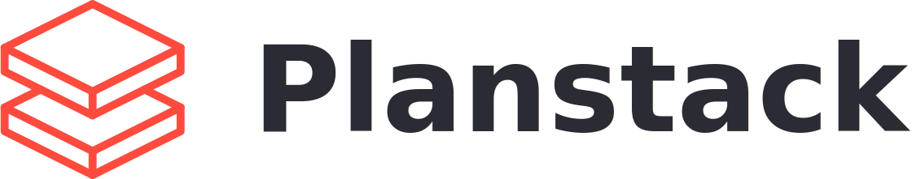

<p align="center">
  
</p>

Planstack organisiert eine **Roadmap als PR-Abhängigkeitsboard** online: Tasks
mit Aufwand und Status, ihre Abhängigkeiten (Gates) und Blocker (Concerns),
gruppiert in Phasen und über mehrere Projekte hinweg. Das Board lässt sich im
Browser betrachten (Abhängigkeitsdiagramm, PR-Sequenz, Kennzahlen) und
vollständig über eine **REST-API bzw. einen MCP-Server fernsteuern** – gedacht
dafür, dass KI-Agenten (Claude Code via Planstack-Skill) ein Board eigenständig
abarbeiten.

## Features

- **Multi-Projekt** mit offener Registrierung, Teams und rollenbasiertem Zugriff
  (Owner/Admin/Architect) je Projekt.
- **Tasks** mit lesbarem Kürzel (z. B. `C23`), Aufwand (Personentage / Story
  Points / geschätzte Tokens / betroffene Dateien) und Status-Workflow.
- **Requirements** (Gates) modellieren Task-Abhängigkeiten; **Concerns**
  dokumentieren Blocker/Fehleinschätzungen/offene Owner-Entscheidungen (1:1).
- **Drei Statusansichten:**
  - *Diagramm* – interaktiver Mermaid-Abhängigkeitsgraph (Farbe = Kategorie,
    Icon = exakter Status, Rahmen = Aufmerksamkeit; Flaschenhals-Badge; PNG-Export).
  - *PR-Sequenz* – nach Reihenfolge/Flaschenhälsen sortierte Liste offener PRs.
  - *Summary* – KPIs, Velocity/ETA und Phasenfortschritt.
- **GitHub-Anbindung:** Repo pro Projekt konfigurierbar, PR-Verlinkung und ein
  „PRs abgleichen"-Sync, der den Merge-Status offener PRs von GitHub holt.
- **Öffentliche API-Dokumentation** unter `/api-docs` (ohne Login).
- **MCP-Server pro Projekt** (Streamable HTTP, JSON-RPC 2.0) unter
  `/api/projects/{alias}/mcp`.
- **Planstack-Skill-Download:** fertiges ZIP (SKILL.md + vorbefüllte `config.json` +
  `.mcp.json` mit frisch erzeugtem Token) zum sofortigen Einsatz in Claude Code.

## Status-Workflow

`UNKNOWN → BLOCKED / PICKABLE → CLAIMED → ANALYZING → IN_PROGRESS → IN_REVIEW → COMPLETED / MERGED`
(zusätzlich `CONCERNED` für gemeldete Blocker). `BLOCKED`/`PICKABLE` werden aus
dem Gate abgeleitet; ein offener PR schaltet abhängige Tasks frei, `IN_REVIEW`
wird gesetzt, sobald die Arbeit fertig ist und ein PR existiert.

## Tech-Stack

- PHP 8.3, **Laravel 13**, Sanctum (Token-Auth), Breeze (Auth-Scaffolding)
- **MySQL / MariaDB**
- Vite + Tailwind CSS, Mermaid (Diagramm)

## Voraussetzungen

- PHP ≥ 8.3 mit den üblichen Laravel-Extensions (inkl. `pdo_mysql`)
- Composer, Node.js + npm
- Eine **MySQL/MariaDB**-Datenbank. SQLite genügt **nicht** – einzelne
  Migrationen nutzen MySQL-spezifisches `ENUM`.

## Setup

```bash
git clone git@github.com:resKjuMe/planstack.git
cd planstack
composer install

# .env anlegen und Datenbank eintragen (MySQL!)
cp .env.example .env
#   DB_CONNECTION=mysql
#   DB_HOST / DB_PORT / DB_DATABASE / DB_USERNAME / DB_PASSWORD setzen
php artisan key:generate

php artisan migrate
php artisan db:seed        # optional: generischer Demo-Stand

npm install
npm run build
```

Läuft anschließend per `composer dev` (Server + Queue + Logs + Vite parallel)
oder klassisch mit `php artisan serve`. Ist die `.env` mit MySQL vorbereitet,
erledigt `composer setup` die obigen Schritte in einem Rutsch.

Der Seeder legt einen Demo-Login und ein Beispielboard an:

- **E-Mail:** `demo@planstack.test`  ·  **Passwort:** `password`
- Projekt-Alias **`DEMO`**

## Konfiguration

Neben den Standard-Laravel-Variablen kennt Planstack eigene Keys (siehe
`.env.example` und `config/planstack.php`):

| Key | Zweck |
|-----|-------|
| `GITHUB_TOKEN` | Token (Scope `repo`) für „PRs abgleichen"; für private Repos Pflicht |
| `GITHUB_API_URL` | GitHub-API-Basis (nur für GHE/Proxy) |
| `GITHUB_VERIFY_SSL` | TLS-Verifikation der GitHub-Calls (Default `true`) |
| `PLANSTACK_SKILL_API_URL` | Basis-URL, die in die `config.json` des Skill-Downloads geschrieben wird |

Das GitHub-Repo je Projekt (`owner/repo`) wird direkt im Projektformular gepflegt.

## API & MCP

- **REST:** Bearer-Token (Sanctum), erstellbar unter *Profil → API-Token*.
  Endpunkte und Beispiele: **`/api-docs`**.
- **MCP:** per-Projekt-Endpunkt `/api/projects/{alias}/mcp` mit denselben Tokens;
  Tools u. a. `get_board`, `list_tasks`, `claim_task`, `set_task_status`,
  `set_task_pr`, `merge_task`, `create_task`, `update_task`, `split_task`.

Der schnellste Einstieg für einen Agenten: im Projekt den **Planstack-Skill als ZIP
herunterladen** – es enthält SKILL.md, eine vorbefüllte `config.json` und eine
`.mcp.json` inklusive frisch erzeugtem Token.

## Tests

```bash
php artisan test        # oder: composer test
```

## Weiterführend

- Fachliche Spezifikation & Datenmodell: [`docs/SPEC.md`](docs/SPEC.md)
- API-Referenz: `/api-docs` (im laufenden System)

---

Privates Projekt von Christian Mietze, lizenziert unter der [Planstack-Lizenz](LICENSE)
(Elastic License 2.0 mit Zusatzklausel). Das darunterliegende Laravel-Framework ist
MIT-lizenziert.
